# ThunderProxy

ThunderProxy is a local IRC server connecting [ThunderWave](https://github.com/AnthyG/ThunderWave) and [ThunderBird](https://www.thunderbird.net/) (or any other IRC client).

## TODO

1. Send messages to group chats
2. Receive messages from group chats
3. Send messages to private chats
4. Receive messages from private chats
5. ~~Send messages via IRC to lobby~~
6. ~~Receive messages from lobby~~

## Installation and usage

Linux:

```bash
$ git clone https://github.com/imachug/ThunderProxy.git
$ cd ThunderProxy
$ vi config.py
$ sudo python start_server.py # Run local IRC server
```

Windows:

```
> git clone https://github.com/imachug/ThunderProxy.git
> cd ThunderProxy
> notepad config.py
> python start_server.py # Run local IRC server
```

## Local server

IRC server is ran on `localhost`, port `6667`. Configure your IRC client to access that address.

Set username to `<yourname>/<authprovider>`, e.g. `gitcenter/zeroid.bit`.

## Examples

First, run `python start_server.py`.

### Configuring ThunderBird

1. Open ThunderBird and press `Chat`  
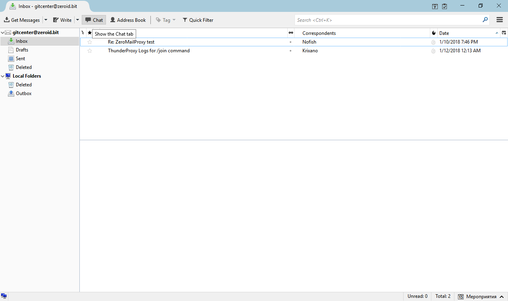
2. Press `Show Accounts`  
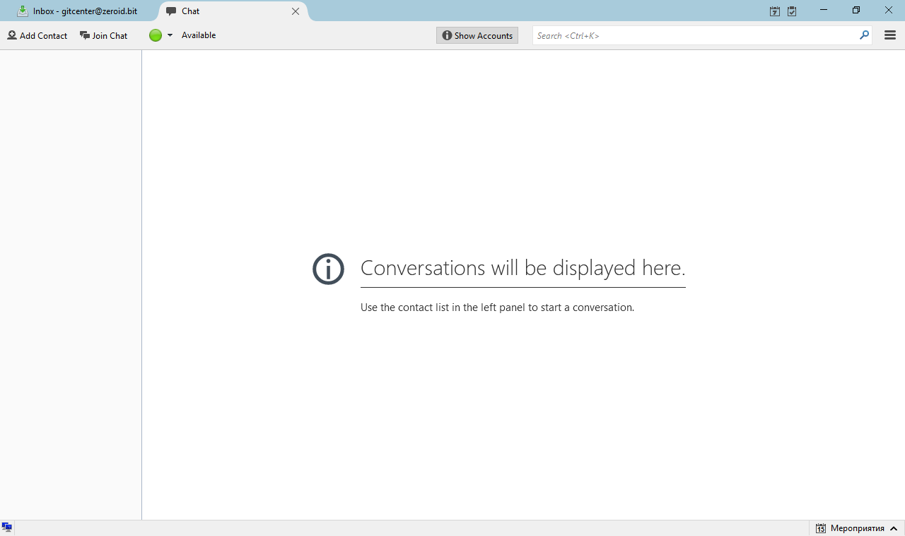
3. Press `New Account`  
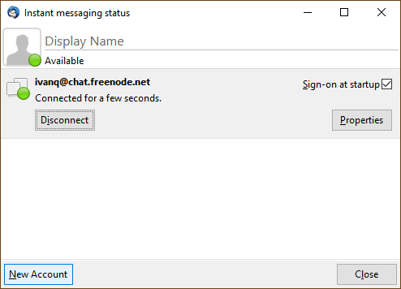
4. Choose **IRC**  
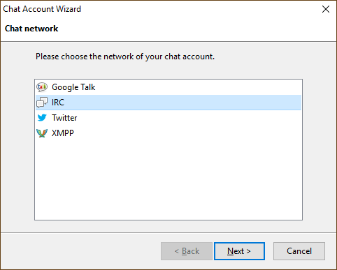  
5. Use username `<yourname>/<authprovider>` and server `localhost`  
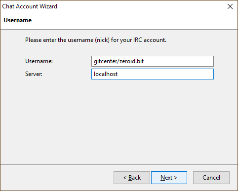
6. Leave password empty  
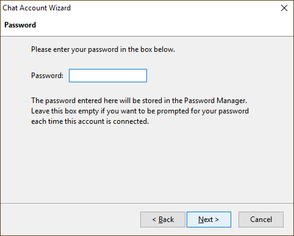
7. Open **IRC Options**:
    * Choose port `6667`
    * Uncheck **Use SSL**
    * Press `Next >`  
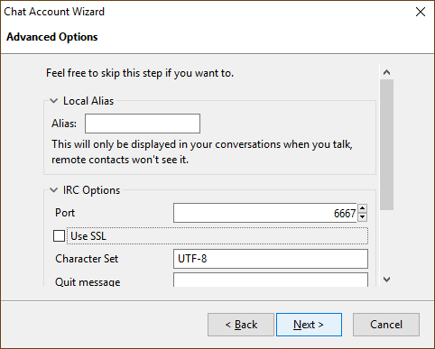
8. Press `Next ->` and then `Finish`  
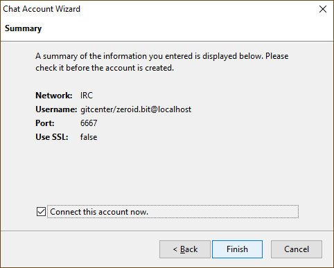
9. *(optional)* Join channel `lobby`  
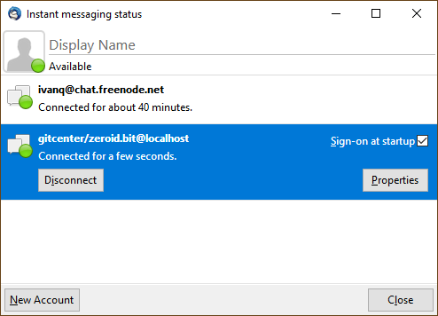

### Configuring mIRC

1. Start mIRC  
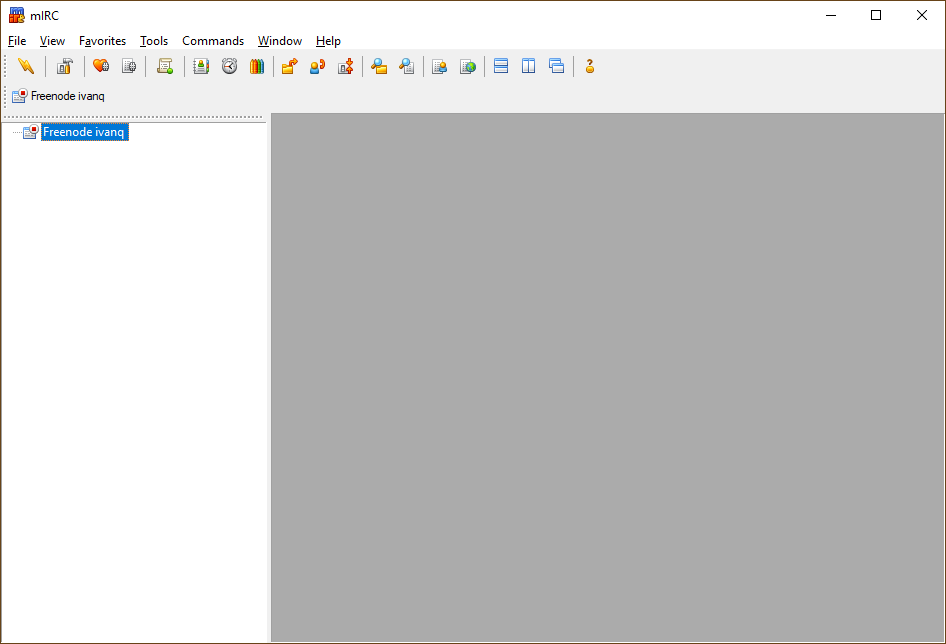
2. Open **mIRC Options**  
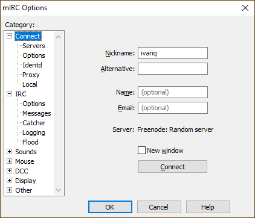
3. Choose `Servers` in sidebar  
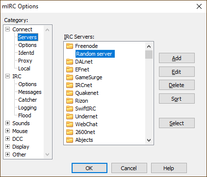
4. Press `Add`  
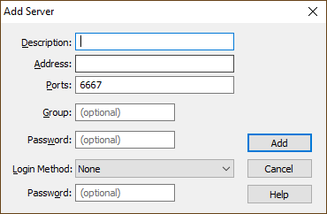
5. Choose address `localhost` and press `Add`  
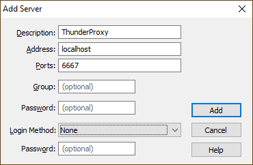
6. Press `Select`  
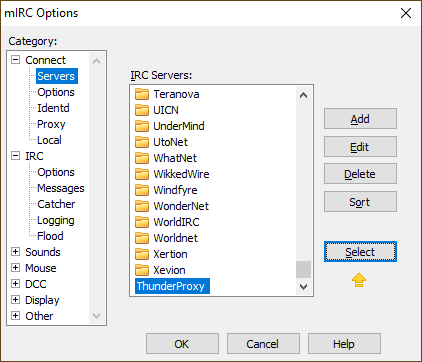
7. Enter nickname `<yourname>/<authprovider>` and press `Connect`  
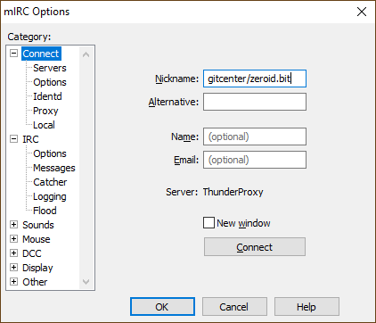
8. Click `ThunderWave <yourname>/<authprovider>` in sidebar  
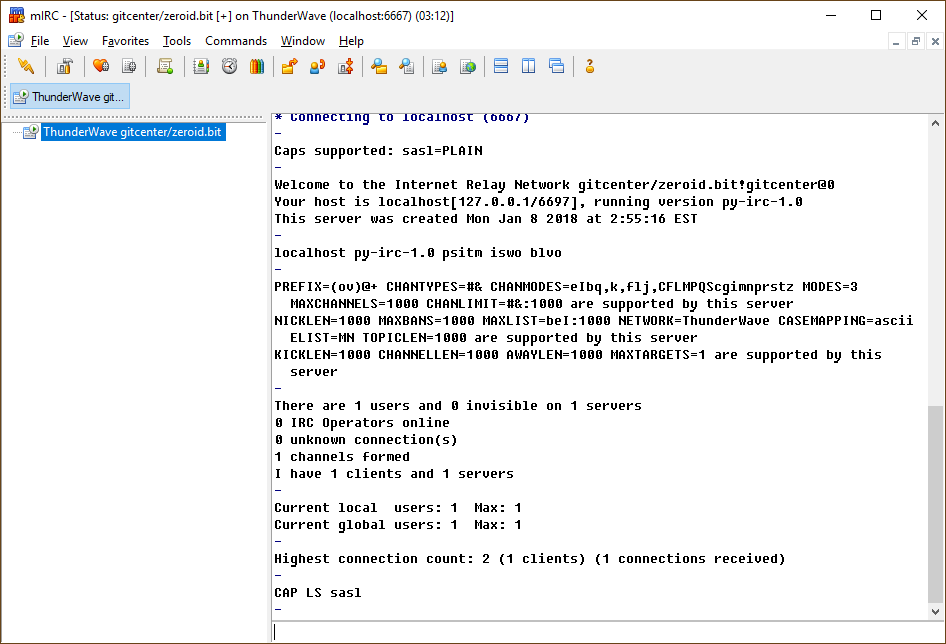
9. *(optional)* Type `/join #lobby`  
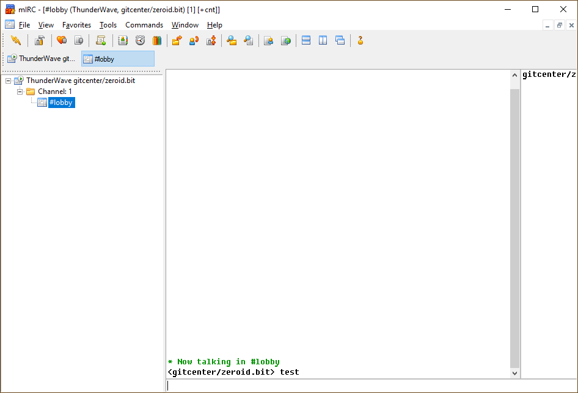